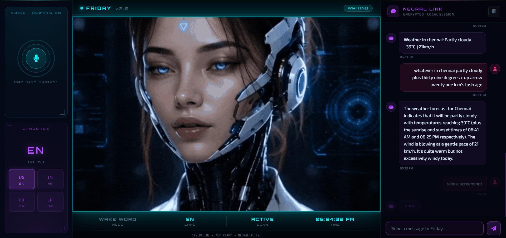

<div align="center">


# F.R.I.D.A.Y.
### Female Replacement Intelligent Digital Assistant Youth

> *Your personal AI assistant — inspired by Iron Man's F.R.I.D.A.Y.*


</div>

---

## 🤖 About

**F.R.I.D.A.Y.** (Female Replacement Intelligent Digital Assistant Youth) is a voice-enabled, AI-powered desktop assistant built entirely in Python with a sleek, interactive web-based interface. Inspired by the iconic AI from the *Iron Man* and *Avengers* universe, this project brings a futuristic assistant experience to your own machine.

Unlike simple chatbots, F.R.I.D.A.Y. is designed to act as a true productivity companion — one that listens to your voice, understands your intent, searches the web on your behalf, and responds intelligently in real time. Whether you're asking for the latest news, setting reminders, performing quick web lookups, or just having a conversation, F.R.I.D.A.Y. handles it all through natural language, no typing required.

The project is built with a clean separation between the **Python backend** (which powers the AI logic, voice processing, and module execution) and a **modern web-based frontend** (which renders the UI in your browser). This architecture makes it easy to extend, customize, and scale — add a new module and instantly unlock new capabilities for the assistant.

F.R.I.D.A.Y. is perfect for developers, students, and enthusiasts who want to explore AI assistant development, speech recognition, and real-world Python application design — all wrapped in a polished, Tony Stark-approved interface.

---

## ✨ Features

- 🎙️ **Voice Recognition** — Speak commands naturally using your microphone; F.R.I.D.A.Y. listens, transcribes, and acts in real time without requiring any keyboard input
- 🧠 **AI-Powered Responses** — Intelligent, context-aware reply generation for a wide range of queries, from factual questions to casual conversation
- 🌐 **Web Search Integration** — Instantly search the internet on voice command and get summarized, relevant results delivered back to you
- 🖥️ **Modern Web UI** — A visually immersive, responsive frontend built with HTML, CSS & JavaScript that mirrors the aesthetic of a sci-fi HUD interface
- ⚙️ **Modular Architecture** — A plug-and-play module system that lets you add new features (weather, jokes, system info, etc.) without modifying core assistant logic
- 🔧 **Fully Configurable** — Easily customize the assistant's name, wake word, voice output, API keys, and active modules through simple config files
- 🔊 **Text-to-Speech Output** — F.R.I.D.A.Y. speaks back to you using natural-sounding TTS, making the experience feel like a real conversation
- 📋 **Task Automation** — Automate repetitive desktop tasks and system commands through voice triggers
- 🕐 **Real-Time Interaction** — Near-instant response times with a clean streaming interface between the Python backend and the browser UI

---

## 📁 Project Structure

```
Friday-ai/
├── assests/          # Images, icons, banner graphics, and static media files
├── backend/          # Core Python engine — AI logic, voice recognition, TTS, routing
├── config/           # Configuration files: API keys, wake word, module toggles, preferences
├── modules/          # Feature modules — each file adds a new skill to the assistant
├── ui/               # Frontend interface — HTML templates, CSS styles, JavaScript logic
└── .gitignore        # Files and folders excluded from version control
```

### Folder Breakdown

- **`backend/`** — The brain of F.R.I.D.A.Y. Contains the main entry point (`main.py`), speech recognition pipeline, NLP/intent processing, and the response engine that routes commands to the right modules.
- **`modules/`** — Each module is a self-contained Python file that handles a specific task (e.g., web search, system info, greetings, jokes). Adding a new `.py` file here automatically extends what F.R.I.D.A.Y. can do.
- **`config/`** — Stores all user-facing settings. Tweak this to personalize the assistant's personality, voice, wake word, and connected APIs.
- **`ui/`** — The browser-based dashboard that displays F.R.I.D.A.Y.'s responses, listening state, and interaction history in a futuristic HUD-style layout.
- **`assests/`** — Static resources like the banner image, icons, and any media used by the UI or documentation.

---

## 🚀 Getting Started

### Prerequisites

- Python **3.8** or higher
- `pip` (Python package manager)
- A working **microphone** for voice input
- A modern web browser (Chrome, Firefox, Edge)
- Internet connection (for web search and API features)

### Installation

1. **Clone the repository**
   ```bash
   git clone https://github.com/ompreet-s/Friday-ai.git
   cd Friday-ai
   ```

2. **Install Python dependencies**
   ```bash
   pip install -r requirements.txt
   ```
   > If a `requirements.txt` is not present, install the core libraries manually:
   ```bash
   pip install speechrecognition pyttsx3 requests flask
   ```

3. **Configure the assistant**

   Open the `config/` directory and edit the relevant config file:
   - Set your **wake word** (default: "Friday")
   - Add any **API keys** needed for modules (e.g., OpenWeatherMap, NewsAPI)
   - Enable or disable specific **modules**
   - Adjust **TTS voice speed and volume**

4. **Run the assistant**
   ```bash
   cd backend
   python main.py
   ```

5. Open your browser and go to the **localhost address** shown in the terminal (e.g., `http://127.0.0.1:5000`) to access the F.R.I.D.A.Y. UI.

6. Say your wake word and start giving commands! 🎙️

---

## 🛠️ Configuration

The `config/` directory is your control panel for everything about F.R.I.D.A.Y.'s behavior and personality:

| Setting | Description |
|---|---|
| `wake_word` | The trigger phrase to activate the assistant (default: `"Friday"`) |
| `voice_speed` | TTS speech rate — higher = faster |
| `voice_volume` | Output volume from 0.0 to 1.0 |
| `api_keys` | Keys for external services (weather, news, search APIs) |
| `modules_enabled` | Toggle individual modules on or off |
| `assistant_name` | Change what F.R.I.D.A.Y. calls herself in responses |

## Demo

<div style="display:"flex">


</div>

---

## 📦 Modules

F.R.I.D.A.Y. is built around a modular skill system. Each file in the `modules/` folder adds a new capability to the assistant. Current modules include:

- 🔍 **Web Search** — Search Google or other engines and return summarized results
- ☁️ **Weather** — Get current weather and forecasts for any location
- 📰 **News** — Fetch the latest headlines on any topic
- 🕐 **Date & Time** — Tell the current time, date, or day of the week
- 💬 **Small Talk** — Handle casual conversation and greetings
- 🖥️ **System Info** — Report CPU usage, battery status, memory, etc.
- 😂 **Jokes** — Lighten the mood with a random joke on demand

**Adding a new module** is as simple as creating a new `.py` file in the `modules/` folder and registering the intent keywords. No changes to the core backend are required.

---

## 🤝 Contributing

Contributions are welcome! If you'd like to improve F.R.I.D.A.Y., fix a bug, or add a new module:

1. Fork the repository
2. Create a feature branch
   ```bash
   git checkout -b feature/your-feature-name
   ```
3. Make your changes and commit with a clear message
   ```bash
   git commit -m "Add: your feature description"
   ```
4. Push to your fork
   ```bash
   git push origin feature/your-feature-name
   ```
5. Open a **Pull Request** and describe what you've added or changed

Please keep code clean, modular, and well-commented. Bug reports and feature suggestions via Issues are also very welcome.

## 📜 License

This project is open source and free to use. You are welcome to modify, distribute, and build upon it with appropriate attribution to the original developers.

## 👨‍💻 Developed By

<div align="center">

| Developer | GitHub |
|---|---|
| Supreet37 | [@Supreet37](https://github.com/Supreet37) |
| ompreet-s | [@ompreet-s](https://github.com/ompreet-s) |
| sudeshna-24 | [@sudeshna-24](https://github.com/sudeshna-24) |

<br>

## 🌟 Open to Collaboration

Have an idea to make F.R.I.D.A.Y. smarter, faster, or cooler? We'd love to have you on board!

Whether you're a developer, designer, AI enthusiast, or just someone with a great idea — **you are welcome to collaborate**. Feel free to fork the repo, open an issue, suggest a feature, or reach out to any of the developers directly via GitHub.

Let's build something extraordinary together. 🚀

</div>

